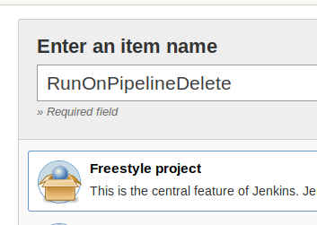
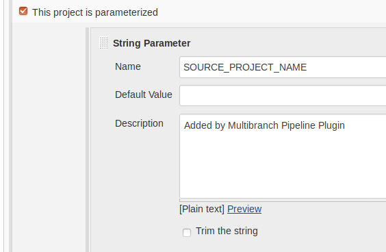

MultiBranch Action Triggers Plugin
==================================

This plugin enables building/triggering other jobs when a Pipeline job is created or deleted by Multi Branch Pipeline Job.

Summary
=======
Multi Branch Pipeline Jobs are capable of creating/deleting Pipelines depending on the branches in the repository.

For some reasons, tasks/jobs/scripts may be needed to run depending on Pipeline creation/deletion. For example,
you may need to build up a new environment when a new branch is created and this environment must be ready before
the pipeline starts. Also same behavior may be necessary for destroying environments with the deletion of the branch/Pipeline.

This plugin enables triggering/building Jobs when a new Pipeline is created or deleted with in the Multi Branch Pipeline job.

How It Works
============
1. Install plugin from Update Center of Jenkins.

2. Create your Jobs (Pipeline/FreeStyle) which will be triggered. You can define any name for your jobs.

   Example screenshot:
   
   
   Example screenshot:
   

3. Create your Multi Branch Pipeline 

    Example screenshot:
    

4. Define "Pipeline Action Triggers" Jobs at the bottom of the configuration page of the Multi Branch Pipeline.
    - This fields has Auto-Complete feature.
    - You can define more then one Job. All jobs defined in this fields will be triggered/built in the same time.
    - Do not forget to save configuration.
    
    Example screenshot:
    
    
    Example screenshot:
    

5. After Multi Branch Pipeline indexes the branches and creates Pipelines, you will notice that, Jobs that you defined
in "Pipeline Create Event" field has the same number of builds with the number of Pipelines. 
    - When you go to Configuration of the Jobs, you will notice that Build Parameter is defined automatically. 
    - Branch/Pipeline name value is passed to the job by parameter named "SOURCE_PROJECT_NAME". This parameter will have the
    name of the Pipeline/Branch which is created by Multi Branch Pipeline. For example if you only have master branch
    in your repository, this value will be "master".
    - You can use this variable for your needs in your scripts/pipelines.
    
    Example screenshot:
    
    
Reporting Issues
======
1. Login [Jenkins Jira](https://issues.jenkins-ci.org/secure/Dashboard.jspa) 
2. Create issue with component name "multibranch-action-triggers-plugin"

Humble Request
=================
I will be glad if you could star this project. 

Thanks.